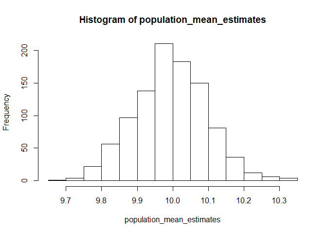

Chapter 2: Simple and Stratified Sampling
================
Tomas Okal
5/13/2020

# Key Points

## Analyzing Simple Random Samples

  - The Horvitz-Thompson estimator of the population total of a variable
    X is defind as .
  - Given a population of size 100 and a simple random sample of size
    10, all of the sampling weights would be equal to 100/10 which would
    be 10.
  - Below, I provide a simulated simple random sample of size 10 derived
    from theoretical population of size 100. Each case has a value for
    variable  pulled
    from a normal distribution with mean 10 and standard deviation of 1.
    Using this estimator gives an estimate of the population total of
    this variable X as roughly around 1000 which given an N of 100 and
    mean of 10, makes sense.

<!-- end list -->

``` r
myDF <- data.frame(caseid = seq(1:10),
                   varX = rnorm(10, mean = 10, sd = 1)
                   )

population_total <- 100/10 * sum(with(myDF, varX))
population_total
```

    ## [1] 1041.51

  - The variance of this estimator can be estimated using the following
    formula ![var\[\\hat{T}\_X\] = \\frac{N - n}{N} \* N^{2} \*
    \\frac{var\[X\]}{n}](https://latex.codecogs.com/png.latex?var%5B%5Chat%7BT%7D_X%5D%20%3D%20%5Cfrac%7BN%20-%20n%7D%7BN%7D%20%2A%20N%5E%7B2%7D%20%2A%20%5Cfrac%7Bvar%5BX%5D%7D%7Bn%7D
    "var[\\hat{T}_X] = \\frac{N - n}{N} * N^{2} * \\frac{var[X]}{n}").
  - The first term in this formula is the finite population correction.
    Since there is no uncertainty about the
     individuals already
    sampled, the assumption is that simple random sampling is needed
    only to estimate the uncertainty in the total of the
     remaining
    individuals left in the population. This disappears from formula if
    the sample is taken with replacement.
  - The population mean of X can be estimated by dividing the estimated
    total by the population size
     using:
    .

<!-- end list -->

``` r
population_mean <- 1/10 * sum(with(myDF, varX))
population_mean
```

    ## [1] 10.4151

  - Using this estimator on the same data as above leads to a population
    mean of around 10, which once again makes sense.
  - Overall, the uncertainty in the population mean of
     is not very
    sensitive to the population size as long as the population is much
    larger than the sample.
  - Theoretically, the variance estimates of both population total and
    population mean suggest that larger sample sizes are better due to
    how the finite population correction term approches 1 as
     approaches
    . However,
    non-response and resource cost mean that in practice, increasing the
    sample size without putting effort into follow-up can increase the
    rate of non-response which could introduce bias that can outweight
    the reduction in variance from the increased sample size.

### Confidence Intervals

  - Confidence intervals for estimates are computed using a Normal
    distribution for the estimate. This does not assume a Normal
    distribution for the data, but rather that repeated simple random
    samples across repeated surveys will produce population mean
    estimates that resemble a Normal distribution.

<!-- end list -->

``` r
function_population_mean_normal <- function(x) {
  
  varX = rnorm(x, mean = 10, sd = 1)
  population_mean <- 1/x * sum(varX)
  
  return(population_mean)
  
}
population_mean_estimates <- replicate(1000, function_population_mean_normal(100))
hist(population_mean_estimates)
```

<!-- -->

### Describing samples in R

  - Using the `survey` package in R, a survey design can be specified
    using the fpc parameter (fixed population count) or the weights
    parameter (sampling weight). Omitting the fpc paramater produces the
    same estimates of both mean and total, but with *larger standard
    errors*.
  - The book provides the example of using the `apisrs` dataset where
    there is an fpc variable of 6194 and a sampling weight of 30.97.
    Given that we know the , in this case 6194, and our
    , in this case a
    simple random sample of 200, we can calculate this sampling weight
    ourselves by simply dividing
     by
     (6194 / 200 =
    30.97).

# Stratified Sampling

  - Other designs can give the same precision of a simple random sample
    at a lower cost. One such approach is stratified sampling, which
    divides population into groups called strata and drawing a separate
    probability sample from each one.
  - Based on this, variation across the stratification variable is
    fixed, and thus no longer random. This leads to more precise
    estimates.
  - Since a stratified sample is just set of simple random samples from
    each strata, the Horvitz-Thompson estimator of the total is just the
    sum of the estimated totals in each stratum, and its population mean
    is estimated by dividing the estimated population total by the
    population size .
  - Stratification like this reduces standard errors, but this
    reducation varies based on how accurately each variable is predicted
    by the population information. Estimates in totals and means can
    either be no more precise or much more precise. The extreme of this
    is the stratification variable itself, which then has a standard
    error of 0.
